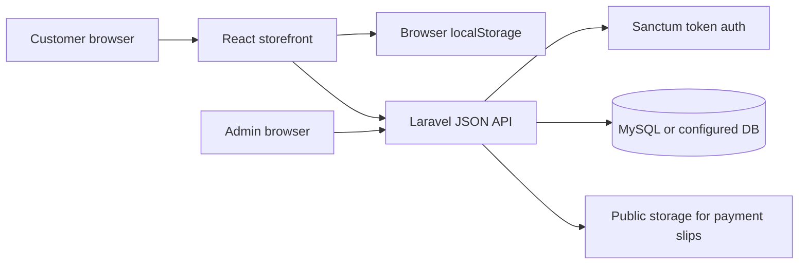
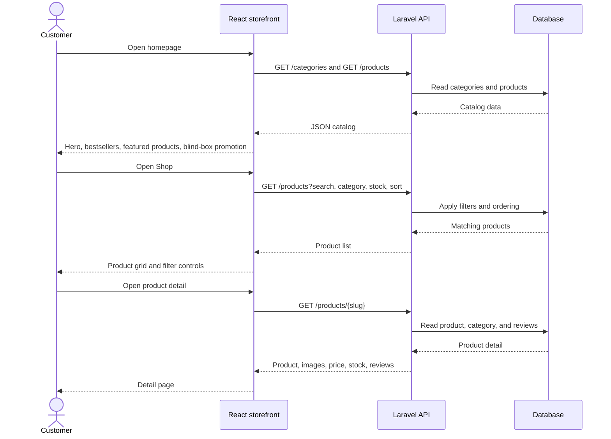
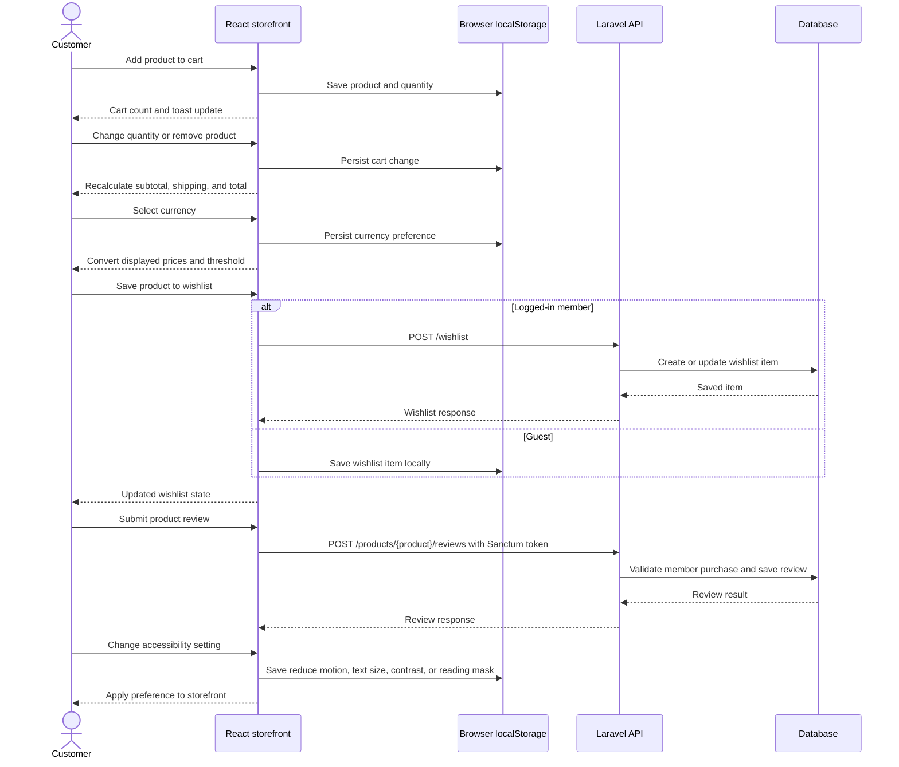
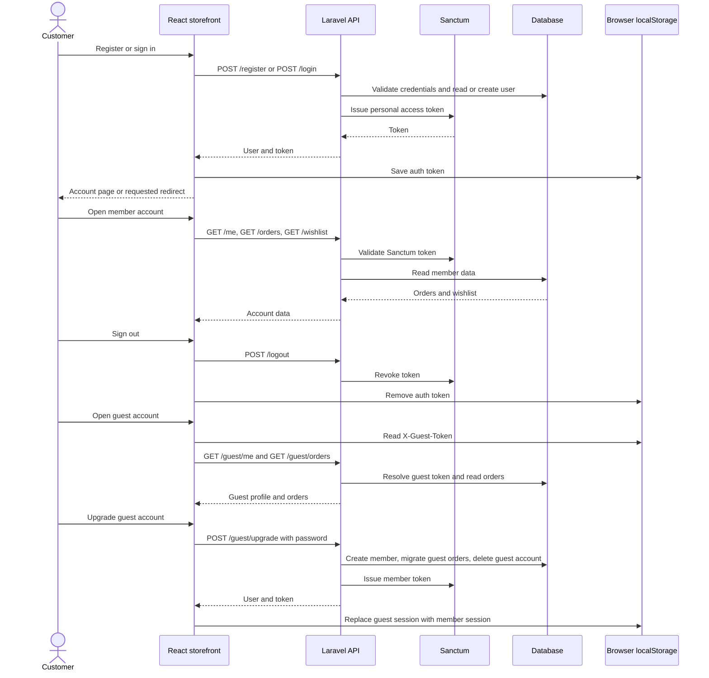
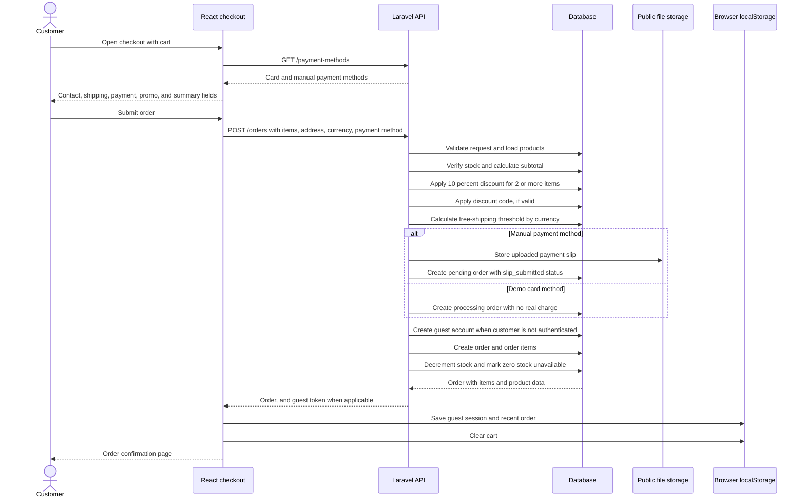
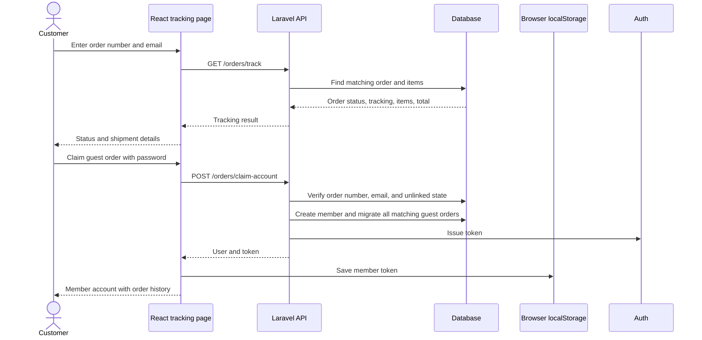
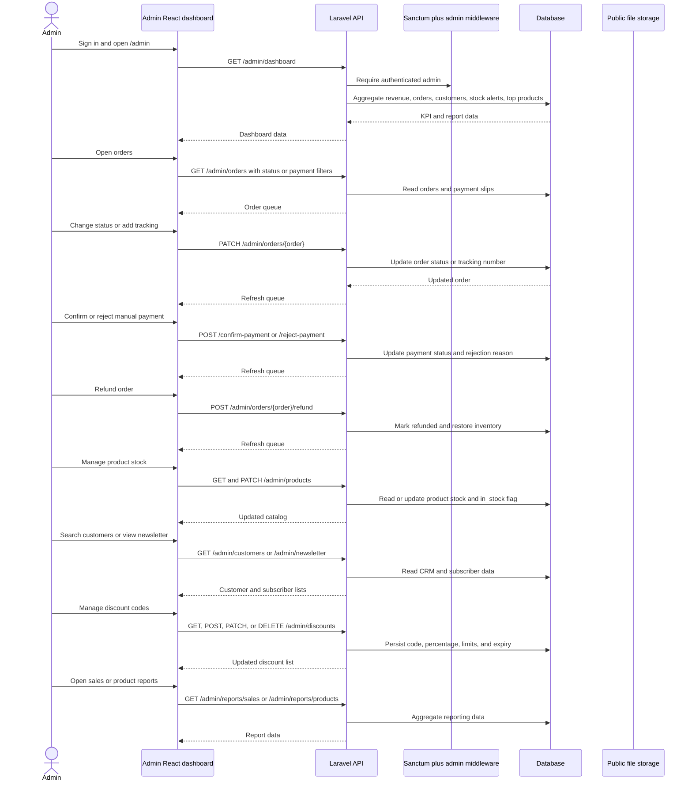

# Mya Hay Thar Ecommerce - Complete Sequence Diagrams

This document describes the current MVP behavior across the React storefront, Laravel API, database, browser storage, and admin dashboard. `Implemented` means it is represented by the current routes/components/API. `Planned` means it is in `FEATURES.md` or `srs.txt` but is not part of the current end-to-end flow.

## System Participants

## 1. Storefront Discovery and Product Browsing (Implemented)

## 2. Cart, Wishlist, Currency, and Accessibility (Implemented)

## 3. Authentication and Account Lifecycle (Implemented)

## 4. Checkout and Order Creation (Implemented)

## 5. Order Tracking and Guest Account Claim (Implemented)

## 6. Admin Dashboard and Operations (Implemented)

## 7. Planned Flows and Current Boundary

These are requirements in the SRS or feature list that do not currently have a complete implemented sequence in the repository:

- Automatic location-based currency detection.
- Product variants such as size, color, and style.
- Digital gift cards and gift-card redemption.
- Shipment email notifications after tracking is added.
- Homepage and blog CMS.
- Saved-address CRUD; the current account screen displays a placeholder address.
- Full refund and return policy workflow beyond the current admin refund endpoint.
- Payment gateway integration; card checkout is explicitly demo-only.
- Real-time admin alerts, conversion rate, taxes, customer support tickets, and customizable reports.
- Sitewide sale banners, homepage carousel management, and blog publishing.
- Legal policy pages and exportable newsletter download.
``